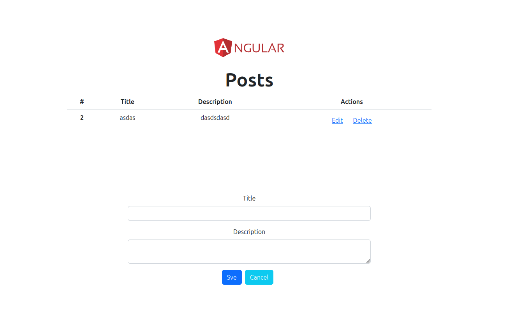
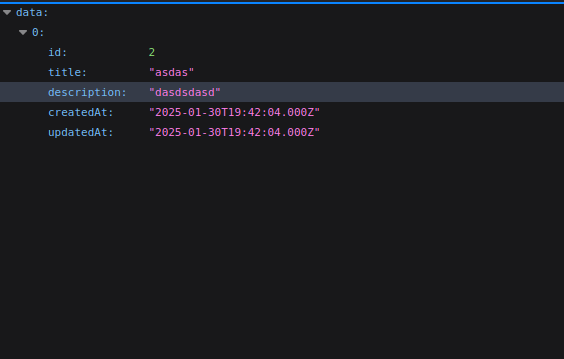
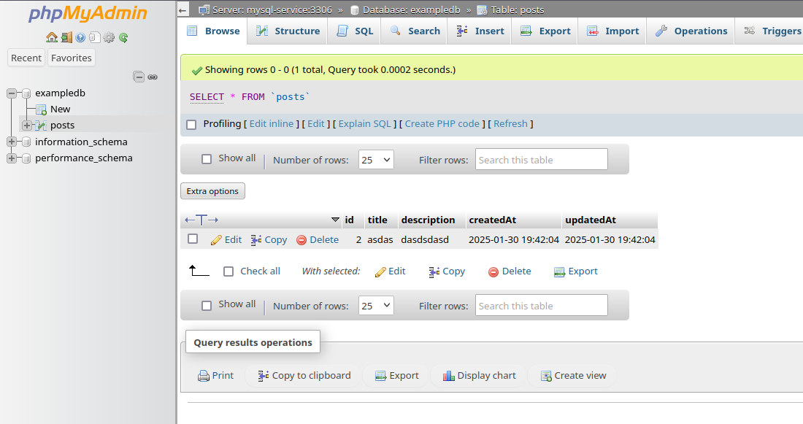

# K8S Sample Full stack project
## based on  [ Dockerize Node + Angular Project ](https://github.com/DanielFarag/presentation-demo)

## Stack
- Node
- Nginx
- Angular
- Mysql [ + phpmyadmin ]

## Endpoints

GET minikube-ip:30080/

GET minikube-ip:30080/api/posts

GET minikube-ip:30081/
